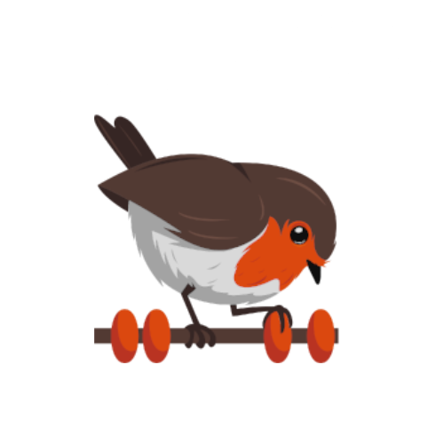

# rotki.dnp.dappnode.eth

Preliminary image to run Rotki on a AVADO box - compatible with Dappnode.

This image compiles already - but is useless until it can run as a standalone headless web or API server.

